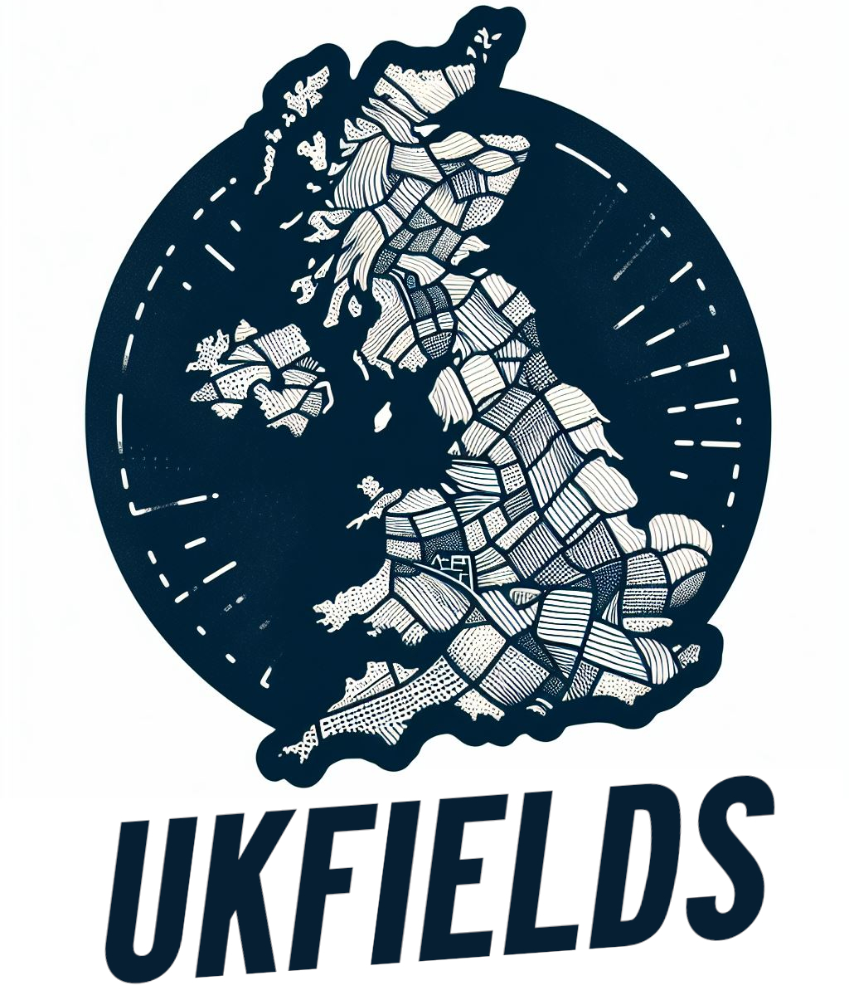

  

# UK Fields

The ukfields dataset is a publicly accessible Earth Engine asset containing over 2.3 million automatically delineated field boundaries spanning England, Wales, Scotland, and Northern Ireland. 

### Credits
This dataset was produced by [Samuel Bancroft](https://github.com/Spiruel) (University of Leeds) and [Jake Wilkins](https://github.com/jakenotjay).

### Dataset Details
The ukfields dataset contains field boundaries for the United Kingdom, derived from harmonic composites of Sentinel 2 imagery captured in 2021. The delineation process leveraged the Segment Anything Model (SAM) from Meta, ensuring efficient field segmentation at scale. The segmented fields have been masked to a 2021 Dynamic World composite of cropland.

### Why Open Data Matters
The availability of accurate field boundary data is of high importance, especially in regions where such information is scarce. Releasing the ukfields datase and the associated code is a step towards democratising access to parcel information over large geographic areas and serves as a blueprint for replicating similar efforts in other regions all over the world.

### Getting Started
To access the ukfields dataset in Google Earth Engine, use the following asset path:

`var ukfields = ee.ImageCollection('users/spiruel/ukfields');`

You can also download a copy from [Zenodo](https://gws-access.jasmin.ac.uk/public/sensecdt/eesjb/ukfields.gpkg).

For more information on accessing and working with the dataset, feel free to contact the authors or raise an issue in this Github repository.
